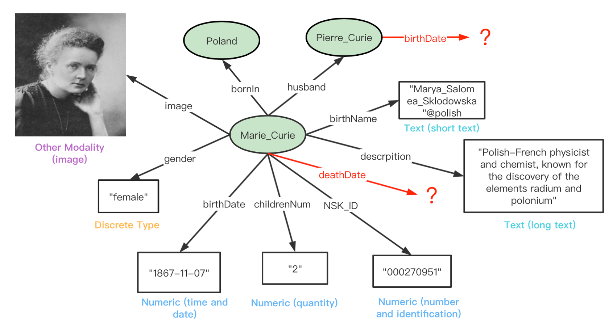
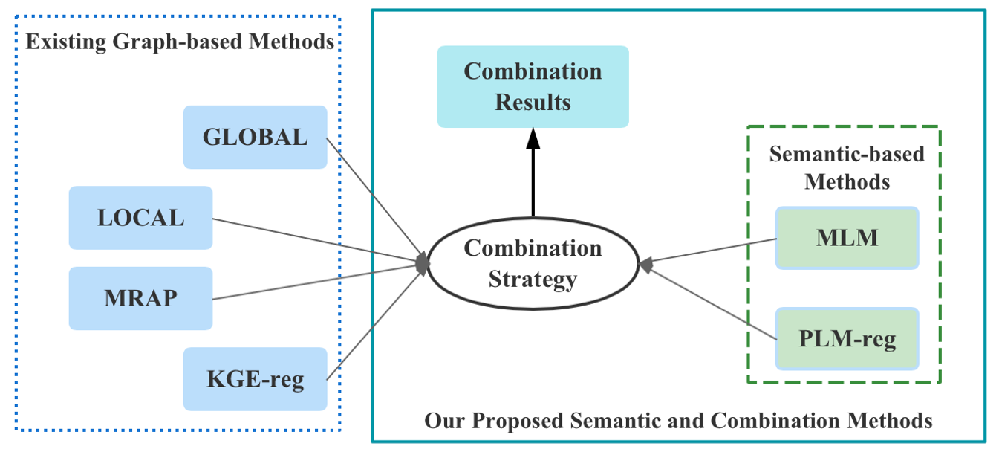
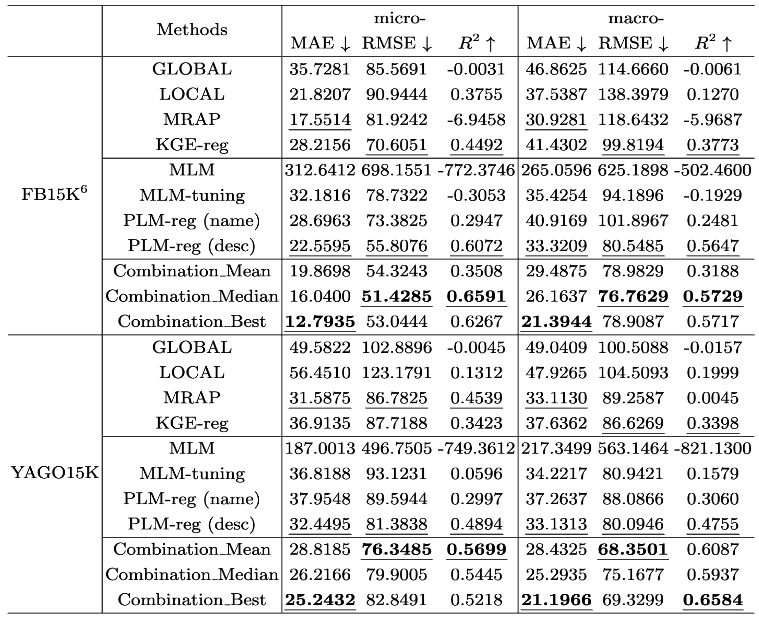

# NumericalPrediction
Implementations of "Introducing Semantic Information for Numerical Attribute Prediction over Knowledge Graphs".

## Overview
In this paper, we focus on the problem of numerical attribute prediction over knowledge graphs. That is to predict missing numerical attribute values given a group of relational facts and numerical attributive facts.
Upon existing graph-based methods, we propose several novel semantic methods as well as effective combination strategies. Experiments on two benchmarks have shown a huge performance improvement.

All the source code, datasets and results can be found in this repository.

## Data
Two datasets (FB15K, YAGO15K) are used from [MMKG](https://github.com/mniepert/mmkb), and the numerical triples are devided into a 80/10/10 split of train/valid/test. The statistics are shown below.

|         | \#Ent | \#Rel | \#Rel\_fact | \#Attr | \#Attr\_fact | \#Train | \#Valid | \#Test |
|:-------:|--------|--------|--------------|---------|---------------|----------|----------|---------|
| FB15K   | 14,951 | 1,345  | 592,213      | 116     | 29,395        | 23,516   | 2,939    | 2,940   |
| YAGO15K | 15,404 | 32     | 122,886      | 7       | 23,532        | 18,825   | 2,353    | 2,354   |

All the data and the preprocessing results are in ./data/.

## Methods
Traditional graph-based methods typically ignore the semantics behind numerical values and are usually incapable of handling unseen and isolated entities. We believe different types of language models, such as bert, have captured and stored rich knowledge during the large-scale pre-training processes and are promising to predict missing numerics.

We provide several novel strategies to capture the implicit knowledge behind pre-trained language models for numerical attribute prediction over KGs, which we call MLM and PLM-reg. Effective combination strategies are also proposed to make full use of both structural and semantic information, where base models are automatically selected for different prediction targets to achieve the best performance. 

## Results
Main results of different methods are listed below. For each dataset, the three blocks top to bottom contain graph-based, semantic-based and combination methods respectively. Best results in each block are underlined and the best ones of all methods are in boldface. Text in parentheses behind *PLM-reg* indicates the type of inputs to PLMs.

These results can demonstrate that the semantic-based methods are quite promising to predict numerical attributes over KGs and effective combination strategies making use of both structural and semantic knowledge can significantly improve the performances.

All the detailed result files are in ./results/.

## Code
Entry code of the proposed methods are:
- GLOBAL/LOCAL/MRAP: graphStructure.py, referring to the implementation of [MrAP](https://github.com/bayrameda/MrAP)
- KGE-reg & PLM-reg: regression.py
- MLM: mlm.py
- Combination: ensemble.py

Some auxiliary files:

- utils.py: data fetching and performance calculation functions for all methods.
- modules.py: base modules for ensemble.py.
- MrAP: graph models for graphStructure.py.
- helpers: auxiliary files including SameAs links between FB15K and YAGO15K, paraphrase templates, and multilingual description texts. Preprocessing functions for different methods are also include in this directory.

*We also conduct several other attempts, such as another paradigm to use pre-trained language models named **prompt**, fine-grained combination strategies on embeddings and so on. These are regarded as future work and not reflected in the paper. We make the code and results temporarily stored in folder ./attempts/.*

## Pre-trained Models
- Pre-trained knowledge graph embedding models are from [LibKGE](https://github.com/uma-pi1/kge), and we adopt four popular embedding techniques in link prediction in our ablation study, namely, TransE, RESCAL, ComplEx, and RotatE for FB15K. And YAGO15K entities are mapped by the [SameAs links](https://github.com/nle-ml/mmkb/blob/master/YAGO15K/YAGO15K\_SameAsLink.txt).
- Pre-trained language models are from [Transformers](https://huggingface.co/models), and we adopt bert-base/large-uncased, roberta-base/large, xlm-roberta-base/large, and [numBert](https://github.com/google-research/google-research/tree/master/numbert) in the ablation study.
- We publish our fine-tuned language models with known attributes [here](https://pan.baidu.com/s/1RlflMTSAFCFihtjQ_48kQw), and the code is in ./helpers/forMLM.py.

All the models can be downloaded from [here](https://pan.baidu.com/s/1RlflMTSAFCFihtjQ_48kQw) with code [i9tv] to replace the ./pretrainedModels folder.

## Notes
The paper is under review now and this is a temporary link for the requirements to anonymity. It will be updated after the review process.

